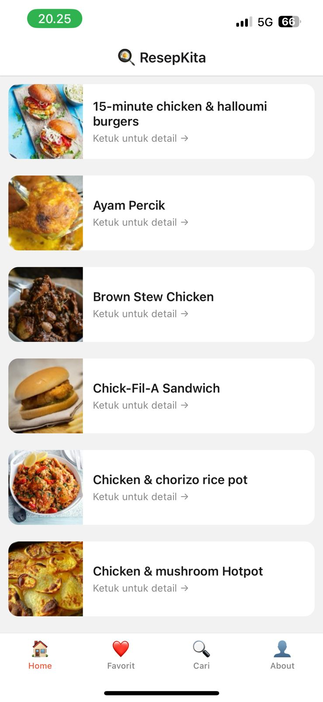
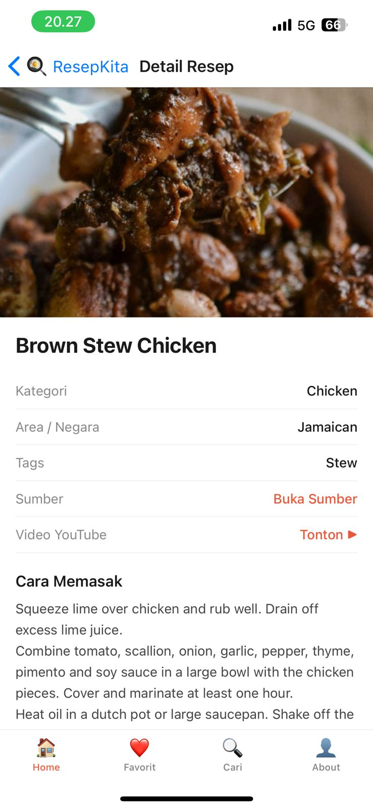
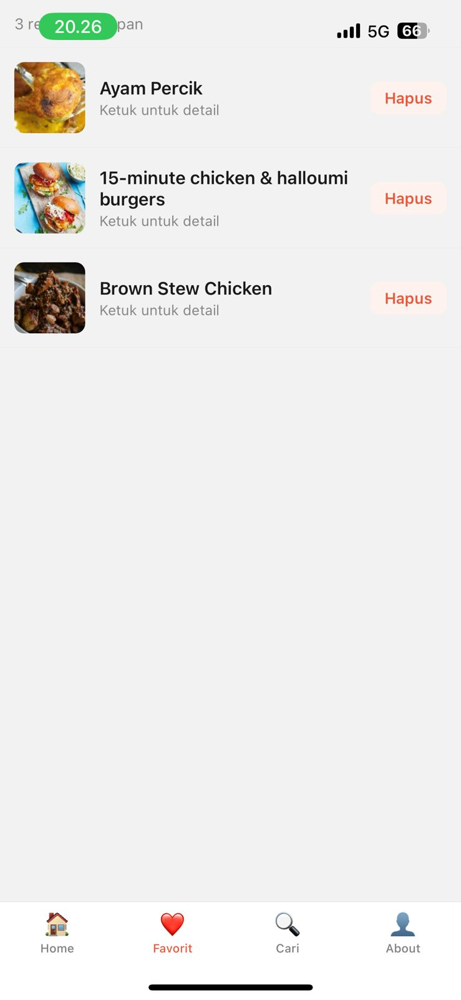
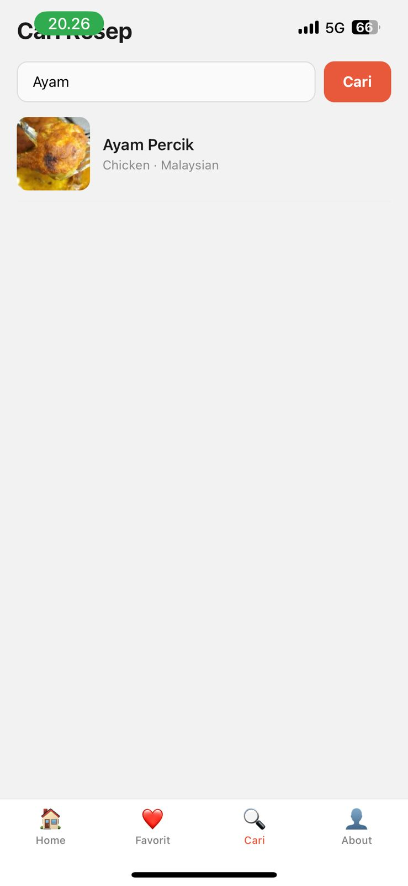
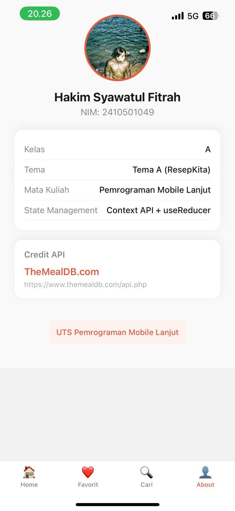

# UTS Pemrograman Mobile Lanjut — ResepKita

| | |
|---|---|
| **Nama** | Nama Lengkap Kamu |
| **NIM** | 2410501049 |
| **Kelas** | A |
| **Tema** | Tema A — ResepKita |

## Tech Stack
- React Native + Expo SDK 51
- React Navigation v6 (Stack + Bottom Tabs)
- Context API + useReducer (State Management)
- Axios (HTTP Client)
- AsyncStorage (Penyimpanan lokal favorit)

## Cara Install & Run
```bash
git clone https://github.com/username/nama-repo.git
cd nama-repo
npm install
npx expo start
```
Scan QR code dengan aplikasi Expo Go di HP.

## Screenshots
<p>
  home :
  
  detail :
  
  favorit :
  
  Cari :
  
  About :
  
</p>

## Video Demo
https://drive.google.com/drive/folders/18_lIR_K44K6KaL4jtNUOxn-42jsWZ_UY?usp=drive_link

## Justifikasi State Management
Saya memilih **Context API + useReducer** karena beberapa alasan:
1. Sudah built-in di React
   tidak perlu install library tambahan, berbeda dengan Redux yang menurut saya terlalu kompleks untuk proyek dengan skala sekecil ini.

2. Cukup untuk kebutuhan proyek
   data global yang perlu dishare antar screen cuma satu yaitu daftar favorit, jadi pakai Context API sudah lebih dari cukup tanpa harus over-engineering.


## Referensi
- https://reactnavigation.org/docs/getting-started
- https://www.themealdb.com/api.php
- https://reactnative.dev/docs/flatlist

## Refleksi
Sebelumnya saya sudah pernah coba React Native sedikit-sedikit, tapi ternyata bikin aplikasi yang lengkap itu jauh lebih susah dari yang saya kira. Yang paling bikin pusing adalah koneksi ke API TheMealDB dan error-error yang muncul selama pengembangan. Mulai dari file foto yang tidak ditemukan, tipe data yang salah di navigasi, sampai masalah versi library yang tidak kompatibel. Tiap error memberi saya pelajaran untuk lebih teliti baca pesan errornya daripada langsung panik.

Proses upload ke GitHub juga jadi menjadi sedikit tantangan. saya pernah menggunakan Git sebelumnya akan tetapi saya masih belum terlalu mahir dalam menggunakannya, dalam pengerjaan tugas ini saya sedikit menambah wawasan mengenai git walaupun tidak signifikan. Intinya proyek ini ngajarin saya bahwa problem solving itu lebih penting dari sekadar hafal sintaks. Kalau ada error, baca pesannya dulu, pahami penyebabnya, baru cari solusinya.
